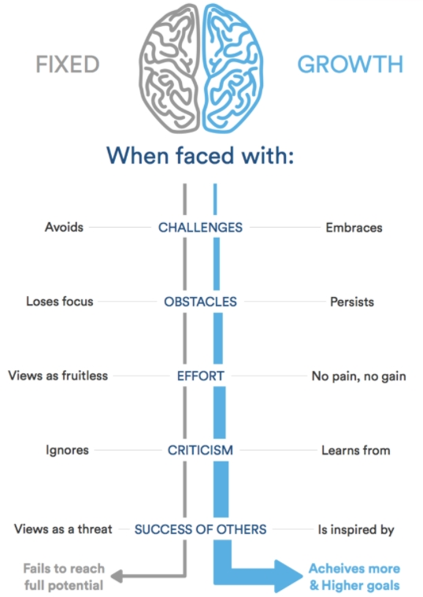

# Growth Mindset
### Growth mindset is a self-development skill. It based on developing our abilities for solving problems by making effort and retrying until success besides possessing intelligence and talent. It sharps our thinking process and gives a new skills.
**Growth mindset go through _five_ stages:**
 - challanges
 - obstacels
 - effort
 - critisim
 - success of the others
 

### somthing to do growthing your mindset:
- [x] face your problem
- [x] make some effort
- [x] don't stop until success

[growth mindset](https://www.atlassian.com/blog/inside-atlassian/growth-mindset)

**go back to** [home page](README.md)

_done by Hisham Khalil :_ 
_a civil engineerin from jordan_
[hisham github profile](https://github.com/HishamKhalil1990)
