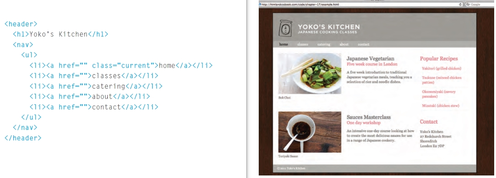

# Introduction to Websites programming

## 1. Introuduction
### a web page made by building a structure similar to newspaper using texts and images difined and modified by tags and attribuates

## 2. Markdown
### Markdown is an easy fast method for styling and formatting a web text instead of HTML so, it considered as lightweight markup language. It is used to control the displaying for the text in the web page to the users. By markdown you can change the font style, making lists and adding some images and links. It is done by surrounding the text with the non-alphabetic characters as (~ or # or >). However, styling ability is limited comparing to HTML.

## 3. HTML5 layout
### HTML file layout consists of two parts:
   1. **_file content structure_**
   2. **_file content style_**
### for constructing the structure of the file the HTML supports a building elements called as HTML tags like `<header>`, `<nav>` and ``  where `src=” ”` is called attribute while for styling the structure we use CSS file or some quick attribute as `style=””`.
### some of the tags are used for dividing the page into parts as:

| tag        | function |
| ---------- | -------- |
| `<header>` | which make a header for the page |
| `<body>`   | where we add the content of the page |

### and some for add components as:

| tag              | function |
| ---------------- | -------- |
| `<nav> `         | add a navigation bar |
| `<ul> `          | add an unordered list |
| `
  `          | add a paragraph |
| `  ` | add an image |

## 4. Process and Design
### website design should satisfy four criteria to be useful and easy for the users and becomes a favorite of them. So the process for building and formatting the website should satisfy:
   1. **_the users’ needs_**
   2. **_easiness for finding the information by the users_**
   3. **_the ability for reaching the users goals_**
   4. **_attractiveness for users_**
## to approach the previous points, they should be turned to the following questions and then answered by the developer in cooperation with the expected user:
  - **_what are the user needs ?_**
  - **_Do they need the information to be general or specified ?_**
  - **_what are the techniques are used for displaying the site in comfortable easy way ?_**
## answering the questions leads for a lot of data that should be arranged by its importance and context so, websites are usually consists of pages that contain contents. some of the best methods to create pages are :

| method                                  | function |
| --------------------------------------- | -------- |
| [site map](images/sitemap.jpg)                 | responsible for the main idea of the page |
| [wireframe](images/wireframe.jpg)              | responsible about the contents shown in the page |
| [visual hierarchy](images/visualhierarchy.jpg) | is responsible about the content appearance to users |

**go back to** [home page](README.md)

