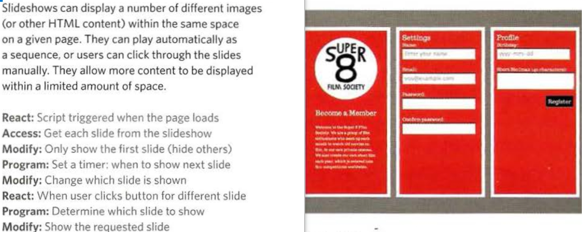
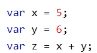
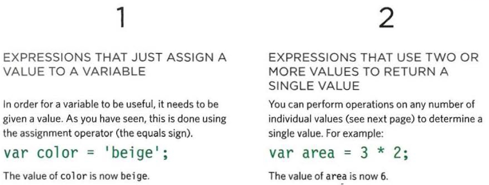
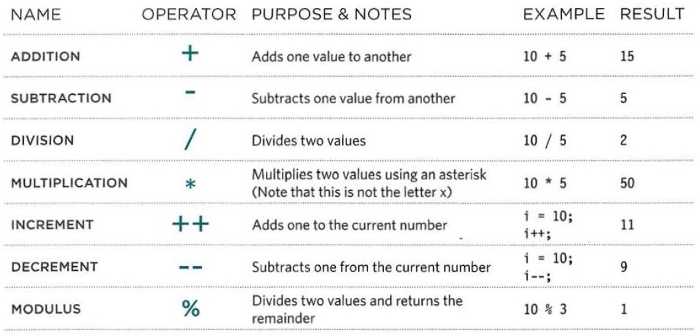
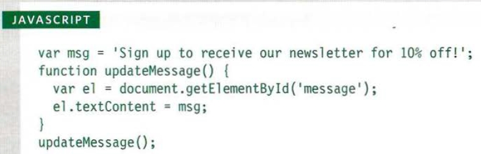
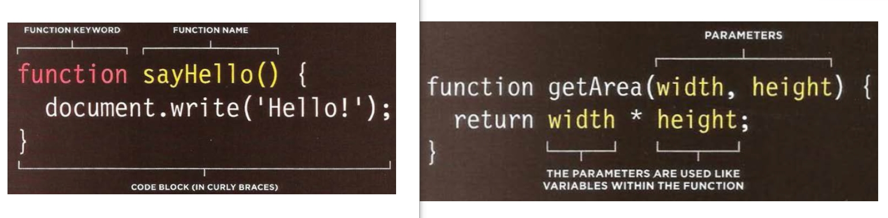

# JavaScript
### JavaScript (js) is a programming language consists of a series of instructions written with a specific scripts. It used by the developer to perform some logic on the input or existed data and get some outputs. it can be used to make the web browser interactive with users. So it adds a dynamic feature to the page contents. It is used to help the browser to:
  1. **_react to event triggered by the user or browser_**
  2. **_access the content of triggered event_**
  3. **_program instruction that will be followed by browser according to situation_**
  4. **_modify the content/s of the page for the users_**

### here are some tips to code with JavaScript:
  1. **_define the goal_**
  2. **_design the script_**
  3. **_code each step_**

## JavaScript language support:

| item | description | example |
| ---- | ----------- | ------- |
| variables | are the stores for the assigned values |  |
| expressions | are the ways to assign values in variables |  |
| operators | non-alphabetic characters used to construct expressions to perform a job |  |
| functions | a group of statements to perform a special task |  |

## a function is consist of a name to call, parameters if needed and a returning value if exist

**go back to** [home page](README.md)
 