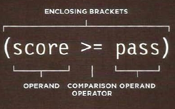
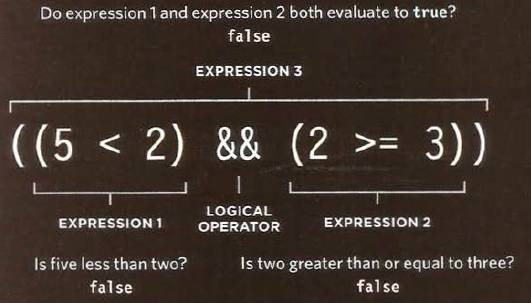
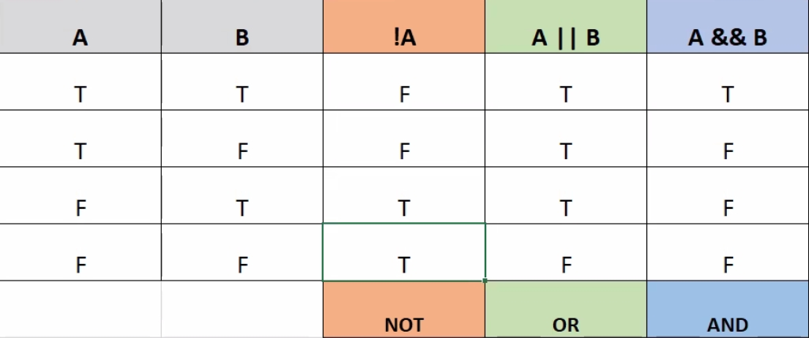

# Comparison and Looping
## 1. Comparison & logical operators 
### Comparison operators are a non-alphabetic characters. they may consist of one, two or three stringed characters. They are used to construct one expression that compare between two values which is referred by a condition. The form of a condition must be one operator and two operands. The operand must place in each side of the operator.  

### The condition is a comparing between two values so; the ending result is a Boolean datatype value (either yes or no). the comparisons operators are:

| operator | function |
| -------- | -------- |
| `==` | do values are equal each other ?|
| `===` | do values and datatypes are equal each other ? |
| `!=` | do values are not equal each other ? |
| `!==` | do values and datatypes are equal each other ? |
| `<` | does the left value is less than the right value  |
| `<=` | does the left value is less than or equal the right value |
| `>` | does the left value is greater than the right value |
| `>=` | does the left value is greater than or equal the right value |

### Logical operators are characters too and they are:

| operator | function |
| -------- | -------- |
| `&&` | and |
| `||` | or |
| `!` | logical not |

### They are used to connect between two conditions or more:

### They are used for comparing the conditions results as follows (T:true , F:flase):

## 2. Looping
### Loops are codes repeat running their inside instructions (statements) as long as the loop condition is true. Loops are consist of three parts:

| part | description | script |
| ---- | ----------- | ------ |
| initialization | the initial value for the condition variable | `var i = 1` |
| condition | the condition variable compared with a limit | `i <= 10` |
| update | the new updated value for the condition variable | `i++`|

### Some of these loop scripts are:

| loop | script | flow chart |
| ---- | ------ | ---------- |
| for | `for (i=1 ; i<= 10 ; i++) { console.log(i); }` | [for](images/forpic.jpg) |
| while | `while (i<= 10) { console.log(i); }` | [while](images/whilepic.jpg) |

