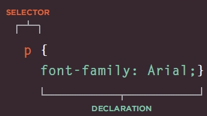

# Functions and CSS rules
## Functions:
### A function is a list of statements (instructions) performs a specific task. It is a way to perform the same task in different parts in the code file without retyping the statements. It is a useful technique to make a fast executed programmed file because functions are not executed until they are called. In JavaScript there is a lot of saved functions can be used to modify the HTML content or make them interactive with the user as `document.write();`. functions are called by their names and filling their parameters with either values or variables contain values if function parameters are existed.Functions are made up by two methods:

| method | script |
| ------ | -------- |
| function declaration  | `function calculate(length,width) {area = length*width; return area;}` |
| expression function  | `var calculate = function(length,width) {area = length*width; return area;}` |

### where are:
  1. **`function` is the function keyword**
  2. **`calculate` is the function name**
  3. **`(length,width)` are the function parameter could be more, less or null if function doesn’t need**
  4. **`area = length*width` is a function statement to do a task, could be more than one**
  5. **`return area` is the function returning value after the run and its optional depending on the function task**

### the previous function is called by `calculate(x,y);` where x and y are the function arguments, they are variables contain a number values assigned by the function user. Note the user can assign values directly as a function arguments `calculate(5,10);` but a best practice to assign variables.

## CSS rules
### HTML content features as (font size, background color,…etc.) can be modified in three ways:
  - **_inline_ inside the tag `<h1 style =”color:red;”> name </h1>`**
  - **_internal_ inside style tag `` inside `<head>`**
  - **_external_ in CSS file which is linked to HTML by the link tag `< link  rel="stylesheet"  href="styles.css" >` inside the `<head>`**
### CSS works by associating rules to HTML elements. The rule in CSS is consists of two parts:
  - **_selector_ indicate to the element that will be styled**
  - **_declaration_ indicate to the type and the value of the style that will be edited**

  

### types of selectors:

| type | description | example |
| ---- | ----------- | ------- |
| type selector | as `p, h1, ul, il, img` and `a` | `p {color:red;}` |
| class selector | for elements how has class attribute `class=” ”` as `class=”paragraph”` | `.paragraph {color:red;}` |
| ID selector | for elements how has id attribute `id=” ”` as `id=”mainParagraph”` | `#mainParagraph {color:red;}` |

### if two selectors are identical then the priority for cascading them by CSS rules is for the most specified rule or the last rule if they are in the same level in specifications
### methods to specifying colors for background and foreground and fonts in CSS:

| method | description | example |
| ------ | ----------- | ------- |
| RGB values | `color:rgb(red,green,blue);` | `color:rgb(100,100,90);` |
| RGBA values | `color:rgb(red,green,blue,opacity);` | `color:rgb(100,100,90,1);` |
| HSL values | `color:rgb(hue,saturation,lightness);` | `color:hsl(0,50%,78%);` |
| HSLA values | `color:rgb(hue,saturation,lightness,alpha);` | `color:hsl(0,50%,78%,1);` |
| HEX code | Hexadecimal code | `color:#ee3e80;` |
| color name | its name | `color:DarkCyan;` |

### when picking colors for background and foreground, it’s important to ensure that there is enough contrast for the text to be legible  

**go back to** [home page](README.md)

